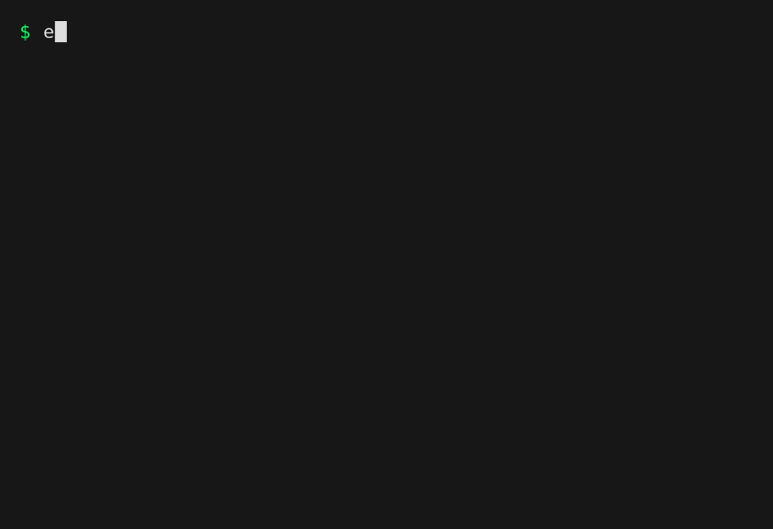

# enventory



Centrally manage environment variables with SQLite

- Automatically export/unexport environments when entering/leaving directories
- Keep a global view of which variables apply to which projects (as well as date created/updated, optional comments). 
- Filter environments to keep your view manageable:

```bash
enventory env list --expr 'filter(Envs, hasPrefix(.Name, "test") and .UpdateTime > now() - duration("90d"))'
```

- Share variables between environments with variable references
- Advanced tab completion! Autocomplete commands, flags, env names, var/ref names
- Currently only supports `zsh`

# Project Status

I'm using `enventory` personally and I quite enjoy using it! That said, I work
on `enventory` for fun/learning, which means changing API and CLI structure as
I feel like it (I feel pretty good about the current structure though).

I do my best to test changes to the codebase (I've actually got a pretty neat
snapshot test system), and I've never lost data, but I'm only human, so back up
sensitive API keys in a password safe (I really like
[KeePassXC](https://keepassxc.org/)) instead of storing them soley in
`envetory`

# Install

- [Homebrew](https://brew.sh/): `brew install bbkane/tap/enventory`
- [Scoop](https://scoop.sh/):

```
scoop bucket add bbkane https://github.com/bbkane/scoop-bucket
scoop install bbkane/enventory
```

- Download Mac/Linux/Windows executable: [GitHub releases](https://github.com/bbkane/enventory/releases)
- Go: `go install go.bbkane.com/enventory@latest`
- Build with [goreleaser](https://goreleaser.com/) after cloning: ` goreleaser release --snapshot --clean`

## Initialize in `~/.zshrc`

> `zsh` is currently the only shell supported

```bash
eval "$(enventory shell zsh init)"
```

This also provides functions `export-env` and `unexport-env` to easily export environments into the current shell session:

```bash
export-env my-environment
```

## Initialize `zsh` Tab Completion

`enventory` is quite a verbose CLI, so tab completion (which also
auto-completes env names, var names, and var ref names) is super useful (to the
point where I wouldn't want to use `enventory` without it). Homebrew does this
automatically.

```bash
enventory completion zsh > /something/in/$fpath
```

# Alternatives

Turns out there are a lot of options in this space! Here are some of my  favorites:

- [`direnv`](https://direnv.net/) - uses `.envrc` files in directories to export variables
- [`dotenv`](https://www.dotenv.org/) - a family of tools to store env vars in config files in directories. Optional encryption
- [`envchain`](https://github.com/sorah/envchain) - Save environment variables in the OS keychain
- [`envelope`](https://github.com/mattrighetti/envelope) - another approach to using SQLite to store environment variables. Side note: I had originally named `enventory` `envelope`. I changed the name once I noticed this project.
- [`mise`](https://mise.jdx.dev/) - manages tool versions, environments, and tasks through config files in directories

# Dev Notes

See [Go Project Notes](https://www.bbkane.com/blog/go-project-notes/) for notes
on development tooling and CI/CD setup (including demo gif generation)

## Generate [`./dbdoc`](./dbdoc) with [tbls](https://github.com/k1LoW/tbls)

Install:

```bash
brew install k1LoW/tap/tbls
```

Run:

```bash
# get a fresh db
go run . env list --db-path tmp.db
tbls doc --rm-dist
```

## Generate [./sqlite/sqlite/sqlcgen](./sqlite/sqlite/sqlcgen)

```bash
go generate ./...
```

## Export OTEL traces!

Debug `enventory` with OTEL tracing:

```bash
MOTEL_TRACES_EXPORTER=stdout go run . env show
```

See the [motel repo](https://github.com/bbkane/motel) for other ways to visualize OTEL traces

## Manually test custom completions

See [`warg`s instructions](https://github.com/bbkane/warg/tree/master/completion)
